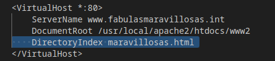

## Añade un DNS al docker-compose (puedes usar el que ya tienes)

configuracion completa del docker-compose incluyendo el DNS:

## Utiliza docker-compose para configurar las IP fijas a los dos contenedores
configuracion ip fija del primer contenedor:

configuracion ip fija del segundo contenedor:

configuracion ip fija del tercer contenedor:

## El DNS tiene que resolver dos dominios a la ip del apache:

resuelve el primero

resuelve el segundo

## Prueba a utilizar la directiva DirectoryIndex

DirectoryIndex se utiliza para seleccionar un fichero html que no es el fichero que se abriría por defecto , es decir , index.html

## Configura dos virtual-host separados para cada dominio en el mismo puerto (80)

